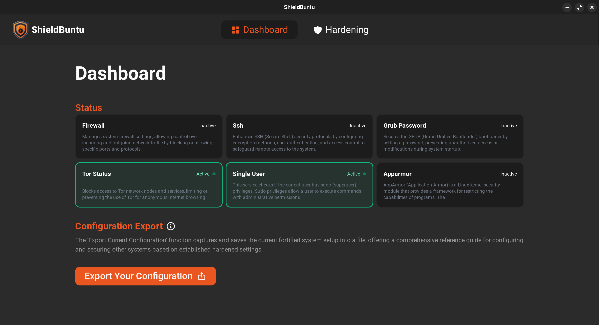
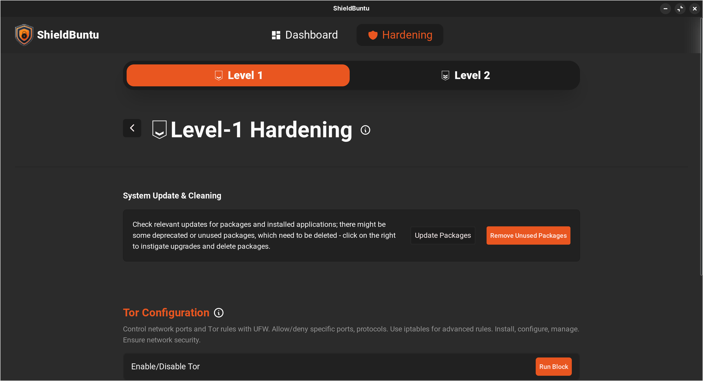
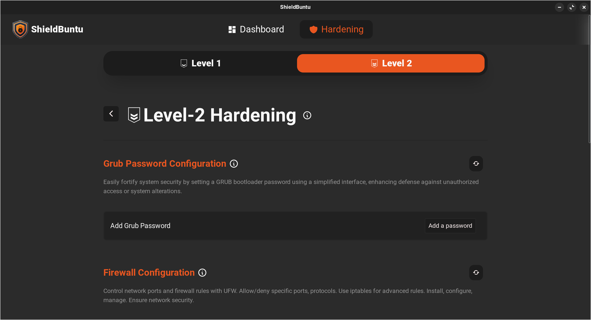

# ShieldBuntu: One-stop Ubuntu hardening solution


<hr>



ShieldBuntu is a system hardening tool for Ubuntu, that provides an ease-to-use GUI interface that makes System Hardening easier for users with less technical knowledge. Here are some key aspects covered in the application:-

1. **AppArmor**
   - Configure AppArmor profiles for enhanced application security.

2. **SSH Hardening**
   - Strengthen SSH configuration for improved access control.

3. **Kernel Hardening**
   - Implement kernel-level security measures.

4. **Tor Blocking**
   - Block TOR network to enhance network security.

5. **Antivirus Installation**
   - Install antivirus software for added protection.

6. **Enable Auditing**
   - Enable system auditing for monitoring and analysis.

7. **Fail2Ban**
   - Set up Fail2Ban to protect against brute-force attacks.

8. **Grub Secure**
   - Secure Grub bootloader configuration.

9. **USB Blocking**
   - Restrict USB access for increased security.

10. **Firewall Setup**
    - Configure a firewall to control incoming and outgoing traffic.
   
Settings can be configured according to the user's convenience and preferences(organizational needs). The hardening features are divided into a couple levels, as mentioned in CIS Benchmarks. **Shieldbuntu** leverages the lightweight Tauri framework, combining the flexibility of React for the GUI and the security of Rust for the backend.

### Screenshots from Level Hardening UI-
- **Level 1**
  
- **Level 2**
  

## Installation

### Prerequisites

Make sure to fulfill all prerequisites listed in the [Tauri Documentation](https://tauri.app/v1/guides/getting-started/prerequisites).

### Clone Repository and Install Dependencies

```bash
git clone https://github.com/samrakshak23/shieldbuntu.git
cd shieldbuntu
npm install
```

### Install Rust and Dependencies

```bash
sudo apt update
sudo apt install libwebkit2gtk-4.0-dev \
    build-essential \
    curl \
    wget \
    file \
    libssl-dev \
    libgtk-3-dev \
    libayatana-appindicator3-dev \
    librsvg2-dev
```
```bash
curl --proto '=https' --tlsv1.2 -sSf https://sh.rustup.rs | sh
```

### Start Development Server
```bash
npm run tauri dev
```

# Tauri + React + Typescript

## How to setup:

Note:- Fullfill all prerequisite present here: [Tauri Prerequisite](https://tauri.app/v1/guides/getting-started/prerequisites)

### Cloning repo and installing dependencies

```bash 
git clone https://github.com/samrakshak23/main.git
cd main
npm install
```

### Starting dev server

`npm run tauri dev`

## USP -
- Easy and intuitive GUI interface. 
- **Customization**: Configuration customization according to organizational policies.
- **Distributability**: The hardened configuration can be exported and distributed among the organization.
